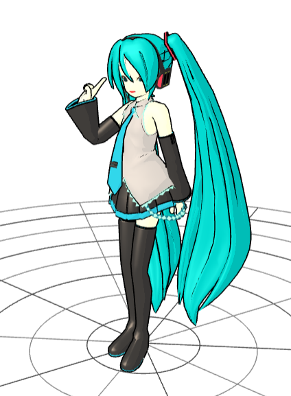

# EXT\_materials\_toon

## Contributors

* Takahiro Aoyagi, Mozilla, [@takahirox](https://github.com/takahirox)

## Status

Draft

## Dependencies

Written against the glTF 2.0 spec.

## Overview

T.B.D.

## Example screenshot



## Defining Toon materials

```
"materials": [
    {
        "name": "toon_material",
        "pbrMetallicRoughness": {
            "baseColorFactor": [ 1.0, 0.0, 0.0, 1.0 ],
            "baseColorTexture": {
                "index": 0
            },
        },
        "extensions": {
            "KHR_materials_toon": {
                "gradientTexture": {
                    index: 1
                },
                "outline": true
            }
        }
    }
]
```

## Fallback

T.B.D.

## Toon material Types

| Property | Type | Description | Requires |
|:------|:------|:------|:------|
| `gradientTexture` | `Object` | | No |
| `outline` | `boolean` | | No, default is `false` |
